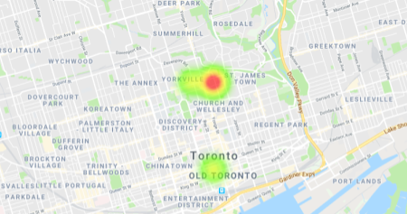

 # mαpα

A Hack the North 2019 Project

Mapa is a tool created for aspiring entrepreneurs seeking to start their own businesses. It extracts data from tens of thousands of transactions which is categorized into different tags such as entertainment, shopping, food and dining, etc. This is then color-coded and plotted, allowing users to see a heatmap. Users can then use this information to find trends that can help them decide where they want to start their business.

The complete project can be found here: https://mapa-7269e.firebaseapp.com/
## User Interface

* Different industries are categorized into different colors, making it easy for users to find specific tags.
* Map can be dragged, zoomed just like Google maps. *After all, it **was** made using Google Maps API!*

## Built With

* [Firebase](https://firebase.google.com/) - Web application development platform used
* [TD-Da Vinci](https://td-davinci.com/) - Used to access millions of realistic virtual customers and their financial information
* [Google Maps Platform](https://developers.google.com/maps/documentation/javascript/tutorial) - Used for map creation

## Authors

* **Jack Bai, Johnny Leung, Matthew Wang, Kaiyi Zhu**

See also the list of [contributors](https://github.com/mslwang/td-app/contributors) who participated in this project.

## Acknowledgments

* Thanks to Hack the North 2019 for providing us the opportunity to work on this project
